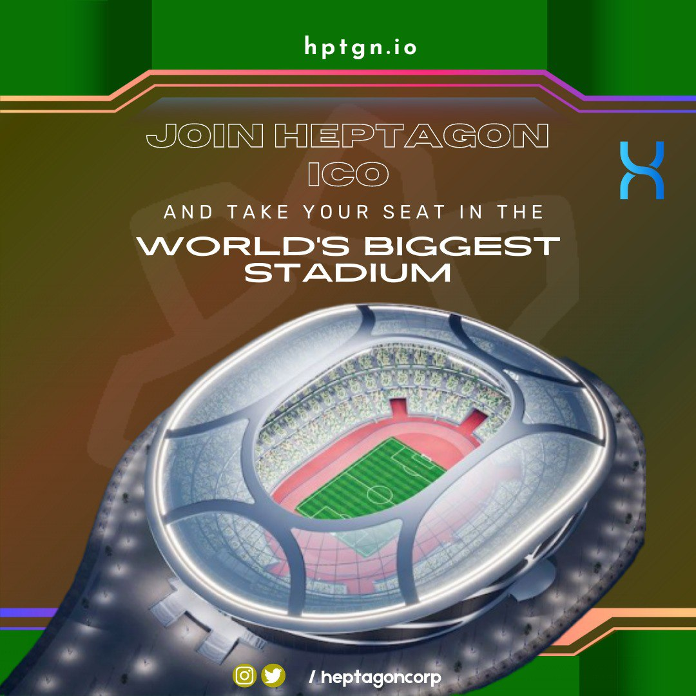

# 🎈 HEPTAGON METAVERSE IDEA

&#x20;``           Now as sports on our world that almost being one of the most important entertainment objects and of this object To Moving it to Metaverse by butting will give a new contribution to the sports economy, and people from this economy make new earnings and they will get gains. Stadiums, which serve a limited number of people in its current state, will offer venue opportunities for investors and entrepreneurs to emerge in this area while turning into an area that can serve an infinite number of people in Heptagon Metaverse. HEPTAGON METAVERSE IDEA

<figure><figcaption>
Heptagon Metaverse
</figcaption></figure>

``

&#x20;            According to statistics, 3 out of every 10 people do regular sports while 7 out of every 10 people follow sports activities regularly. In this sense, the Sports world's move to Metaverse area will ensure that sports lovers reach many more services and a new economic field of activity for humans.&#x20;

``

&#x20;           For this, the HEPTAGON METAVERSE area can participate in sports fans of all ages and all over the world, follow sports activities, perform Virtual Sports meetings, and also. With the 3D Live Broadcast experience, we create an environment where it can watch encounters like they're in the stadium's even when they're enjoying it from there homes.

<figure><figcaption></figcaption></figure>

&#x20;           On Created HEPTAGON Universe our sports lovers they can produce their own NFTS at the NFT market and market these NFTs on their own NFT Platforms that they have created...

&#x20;        The basis we recommend for this whole ecosystem process unit is our HEPTA TOKEN.The HEPTA users who are limited to 360 million units and are produced with constant supply in Virtual Store exchanges, With in NFT production and sales, it will be the only basic unit that our users can use their Tokens for Virtual Competitions in individual or team sports...and other entertainment products that our Heptagon platform will be offering to their users.
