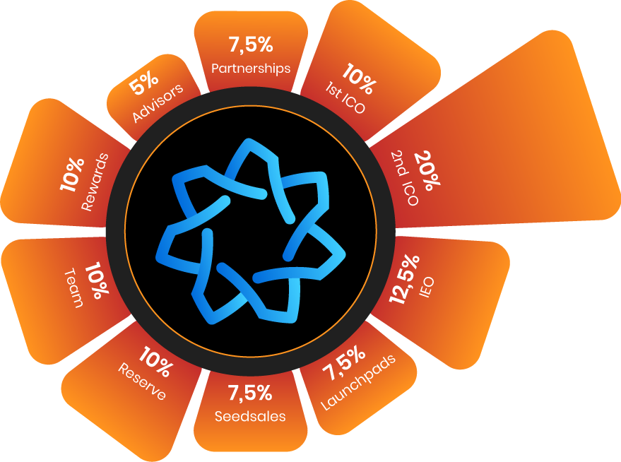

# 🔰 Tokenomics

<figure><figcaption></figcaption></figure>

|                                                                                                                                                                                                                                                                                                                                                                                                                                                                                                                                                                                | Date                            | Supply       | Price |
| ------------------------------------------------------------------------------------------------------------------------------------------------------------------------------------------------------------------------------------------------------------------------------------------------------------------------------------------------------------------------------------------------------------------------------------------------------------------------------------------------------------------------------------------------------------------------------ | ------------------------------- | ------------ | ----- |
| 1st ICO \*                                                                                                                                                                                                                                                                                                                                                                                                                                                                                                                                                                     | 
01.09.2022 15.10.2022
 | 36M. (%10)   | $0,15 |
| 2nd ICO \*                                                                                                                                                                                                                                                                                                                                                                                                                                                                                                                                                                     | 
16.10.2022 31.11.2022
 | 72M. (%20)   | $0.30 |
| IEO \*                                                                                                                                                                                                                                                                                                                                                                                                                                                                                                                                                                         | 
01.12.2022 25.12.2022
 | 45M. (%12,5) | $0.43 |
| Launchpads                                                                                                                                                                                                                                                                                                                                                                                                                                                                                                                                                                     |                                 | 27m. (%7,5)  |       |
| Seedsales                                                                                                                                                                                                                                                                                                                                                                                                                                                                                                                                                                      |                                 | 27M. (%7,5)  |       |
| Reserve \*\*                                                                                                                                                                                                                                                                                                                                                                                                                                                                                                                                                                   |                                 | 36M. (%10)   |       |
| Team \*\*\*                                                                                                                                                                                                                                                                                                                                                                                                                                                                                                                                                                    |                                 | 36M. (%10)   |       |
| Rewards/Bounty \*\*\*\*                                                                                                                                                                                                                                                                                                                                                                                                                                                                                                                                                        |                                 | 36M. (%10)   |       |
| Advisors \*\*\*\*\*                                                                                                                                                                                                                                                                                                                                                                                                                                                                                                                                                            |                                 | 18M.  (%5)   |       |
| Partnerships \*\*\*\*\*\*                                                                                                                                                                                                                                                                                                                                                                                                                                                                                                                                                      |                                 | 27M. (%7,5)  |       |
| 
* Unsold tokens will be burned after every sales period.

** Reserve will be burned in 2 years according to burning program.

*** Locked in 6 months then will be released %20 in every 4 months.

**** Undistributed Tokens in rewards and bounty will be burned.

***** Advisors Tokens will be distributed as marketing process.

****** Partnerships Token will be distributed as marketing and collaboration process.

******* 40% of Hepta Sales revenue will be dedicated to HEPTAGON Metaverse developments and 60% to Marketing.
 |                                 |              |       |

## Release Calendar Sold of Tokens

| Period            | Release Rate | Release Date |
| ----------------- | ------------ | ------------ |
| 1st ICO Seedsales | %20          | 01.01.2023   |
|                   | %7,5         | 25.02.2023   |
|                   | %7,5         | 25.03.2023   |
|                   | %8,5         | 25.04.2023   |
|                   | %9,5         | 25.05.2023   |
|                   | %10,5        | 25.06.2023   |
|                   | %11,5        | 25.07.2023   |
|                   | %12,5        | 25.08.2023   |
|                   | %12,5        | 25.09.2023   |
| 2nd ICO           | %35          | 01.01.2023   |
|                   | %5,5         | 20.02.2023   |
|                   | %5,5         | 20.03.2023   |
|                   | %7,5         | 20.04.2023   |
|                   | %7,5         | 20.05.2023   |
|                   | %8,5         | 20.06.2023   |
|                   | %8,5         | 20.07.2023   |
|                   | %10,5        | 20.08.2023   |
|                   | %11,5        | 20.09.2023   |
| IEO               | %45          | 01.01.2023   |
|                   | %7,5         | 05.02.2023   |
|                   | %7,5         | 05.03.2023   |
|                   | %9,5         | 05.04.2023   |
|                   | %9,5         | 05.05.2023   |
|                   | %10,5        | 05.06.2023   |
|                   | %10,5        | 05.07.2023   |
| Launchpads        | %41          | 01.01.2023   |
|                   | %8,5         | 10.02.2023   |
|                   | %8,5         | 10.03.2023   |
|                   | %9,5         | 10.04.2023   |
|                   | %9,5         | 10.05.2023   |
|                   | %11,5        | 10.06.2023   |
|                   | %11,5        | 10.07.2023   |
| Seeds             | %5,5         | 01.01.2023   |
|                   | %5,5         | 15.02.2023   |
|                   | %5,5         | 15.03.2023   |
|                   | %5,5         | 15.04.2023   |
|                   | %7,5         | 15.05.2023   |
|                   | %7,5         | 15.06.2023   |
|                   | %9,5         | 15.07.2023   |
|                   | %9,5         | 15.08.2023   |
|                   | %10,5        | 15.09.2023   |
|                   | %10,5        | 15.10.2023   |
|                   | %11,5        | 15.11.2023   |
|                   | %11,5        | 15.12.2023   |
