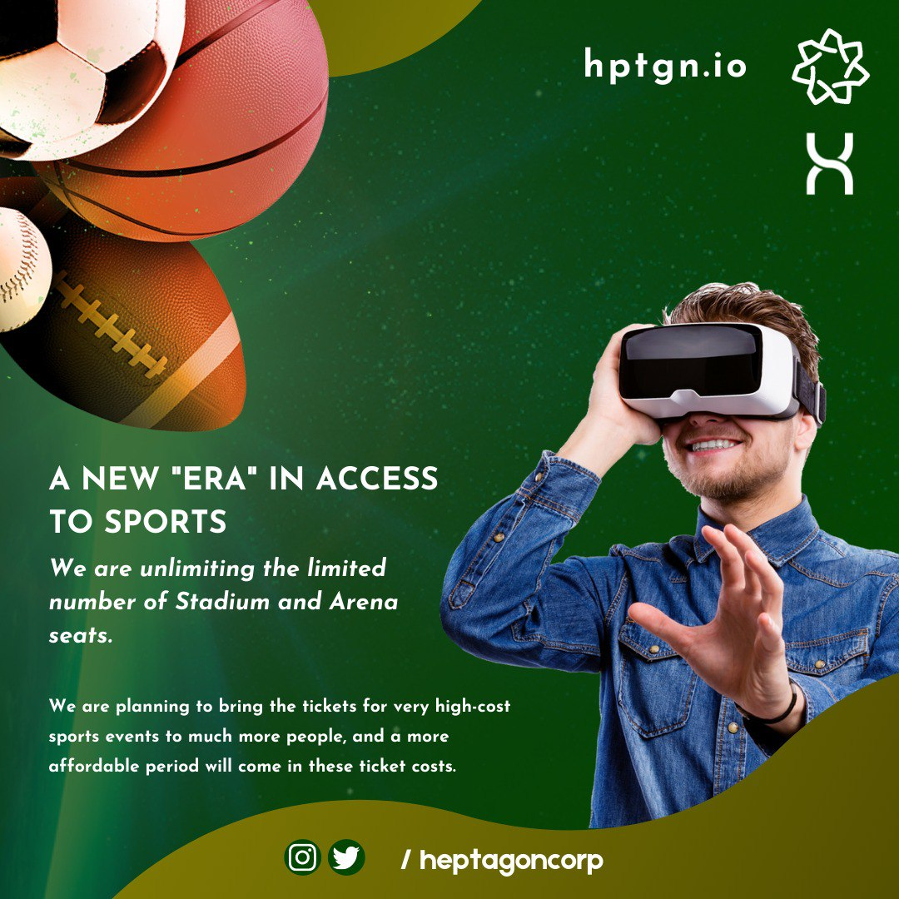

# HEPTAGON ECOSYSTEM -4

Sponsorship agreements with Sports Clubs:&#x20;

&#x20;     As Heptagon Metaverse, it will cooperate with all sports clubs through Advertising and Sponsorship agreements. While promoting and supporting the clubs, selling the club products through virtual stores in the Metaverse environment and the revenues from these, sports clubs will have a brand-new income stream, while Heptagon will become the second home of all fans. The viewers who follow the matches of the clubs in the Heptagon universe will also have instant access to all the news and statistics about the clubs.

&#x20;  Club official products will be available on the Heptagon metaverse, both as NFTs and as real products, and these revenues will provide a new revenue stream to the collaborating clubs.

<figure><figcaption>
Hepta Token
</figcaption></figure>

Heptagon as a new universe for Fan Tokens:&#x20;

&#x20;   Every day, clubs offer their fan tokens and bring them together with their fans. Not only league clubs but also National Teams show interest in this. However, we see that Fan tokens have no real use. Heptagon offers a unique solution in this regard. Fans will now be able to trade their fan tokens on the Heptagon Metaverse by swapping them for Hepta tokens. Thus, fan tokens will easily be equipped with the utility feature of Hepta Token.

