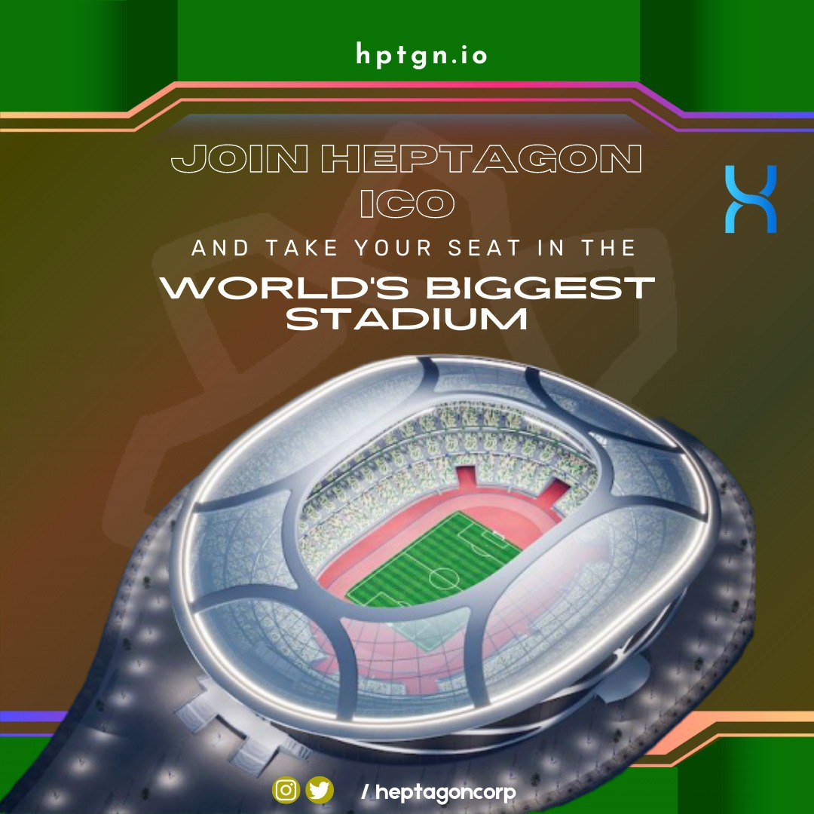

# HEPTAGON METAVERSE -1

&#x20;       Heptagon Metaverse mentioned above is focused to transport the world of sports to Metaverse Area And is a structure built in Metaverse, which is built by scaling the current Real World Stadium and Arenas with the current location. In this structure, Live broadcasts will meet users in Virtual Stadiums in 3D and users will find the opportunity to watch sports events like they were at the Stadiums while they are at their own homes. Heptagon Metaverse refers to an ecosystem that uses Blockchain technologies products and data systems.

<figure><figcaption>
Heptagon Sports Metaverse
</figcaption></figure>

&#x20;                   In this ecosystem, users will be able to produce NFTs and sell these NFTs in the NFT markets they have created... In this universe, where each user will join their own Avatars, users will be able to play individual or team sports with XR glasses and helmets. These games will be held globally and sports lovers of all ages and games will be rewarded with the ecosystem's own token.&#x20;
