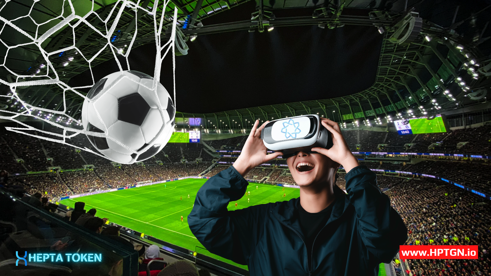

# Final Words on Heptagon

&#x20;     As Heptagon, we build metaverse on two basic principles that complement each other: 3D Virtual World and Blockchain.

&#x20;     We are building Stadiums, Arenas in Heptagon Metaverse. Users of Heptagon Metaverse will be able to connect with their decentralized wallets and watch live broadcasts on a different level of 3D option. We going to bring all events starting from Sports all the way to another end of Arts all on the live broadcast platform, which can be watched as well with the option also on 3D but of course, in our Metaverse environment, connecting The Virtual Universe with a real-world on Heptagon Metaverse that we're creating. Stadiums, Arenas are real and being built at the HEPTAGON METAVERSE with the same coordinates in the world.

<figure><figcaption>
Heptagob Sports Metaverse
</figcaption></figure>

What are users waiting for in Heptagon Metaverse?

1-Live broadcasting events: The opportunity to watch all events from sports to art in Virtual Stadiums, and Arenas as 3D broadcasting ... Users will be able to choose the events that they want to watch in Heptagon Metaverse where they connect with decentralized wallets and access Virtual Stadiums and watch live streams. Users, with their XR glasses in their homes, workplaces, and also using a helmet, it's like they're in the stadium themselves being part of live actions they will get to see and feel the events. 2-Users' Individual and team sports with their XR glasses, their helmets, their gloves, and shoes they will be experiencing the opportunity we offer to them to participate with glasses, and helmets, in the championships in the HEPTAGON METAVERSE world.

3-Heptagon Avatar Market: Users in Heptagon Metaverse will be able to create their own stores, access shopping stores, NFT market, Stadiums, live broadcast events and create their own stores where they can produce and sell their NFT'S.

4-Heptagon Metaverse and Social Media Connection: Here Users can take selfies with their fans and sports players Avatars they support, and share them on social media.

5-Heptagon NFT Market: On the NFT market, they can buy NFTs of the formats they bought T-shirts in decentralized wallets, and send real products to their address.

6-Virtual inter-universal transition: of course, here our Users going to find the extreme that Heptagon Metaverse going to offer them is that they can move around between virtual universes by switching to the powerful infrastructure of Heptagon Metaverse and metaverse areas.

Live Broadcast: Here we all can say a big Woooown ! Forget the live broadcast experiences you've been watching so far...Heptagon is bringing to all his User's a brand new understanding of live broadcast events in a Virtual Stadium with always option on 3D of course And here comes something that makes the difference in Heptagon Metaverse the footage going to be offered to our users with 360-degree cameras that will make your watching live broadcast a joyful moment like no other. A new understanding of Heptagon to bring this in a live broadcast. All branches of sports will be waiting for our users on Heptagon Metaverse.&#x20;

BLOCKCHAIN... Let's remind that Metaverse cannot be characterized as a reliable and independent area without integrating into the blockchain structure with a decentralized structure and solution heptagon Metaverse under his recommendations built this blockchain infrastructure. Heptagon - Users thanks to the Blockchain infrastructure they established in collaboration with EraChain and at the same time when doing all of your operations transparent, decentralized, and safely Blockchain will also benefit from the world of technology facilities. All shopping operations, Mint and sell all NFT that is processed with Blockchain data assurance.
