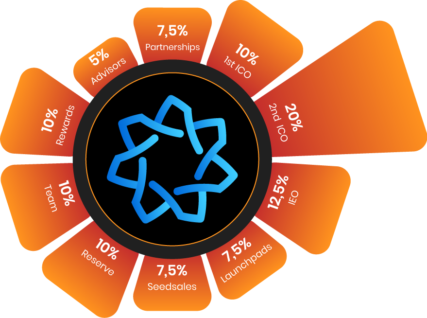

# HEPTA TOKENOMICS

&#x20;          All transactions to be made in HEPTAGON will be stored on the Blockchain, integrated with the BSC network. A total of 360,000,000 units of HEPTA TOKEN have been produced in the BSC network in BEP20 format and are in fixed supply. HEPTAs held as reserves will be burned and withdrawn from the market in the process. Thus, HEPTA TOKEN is not with an increasing supply in the market, but HEPTA TOKEN with a reduced supply and ultimately a constant supply was created. If Softcap is not available, the HEPTAGON team will cover HEPTAGON developments from its own budget. 40% of Softcap's budget will be dedicated to HEPTAGON developments and 60% to Marketing. SOFTCAP: 2M Hepta HARDCAP:5M Hepta

<figure><figcaption>
Hepta Token Tokenomics
</figcaption></figure>
