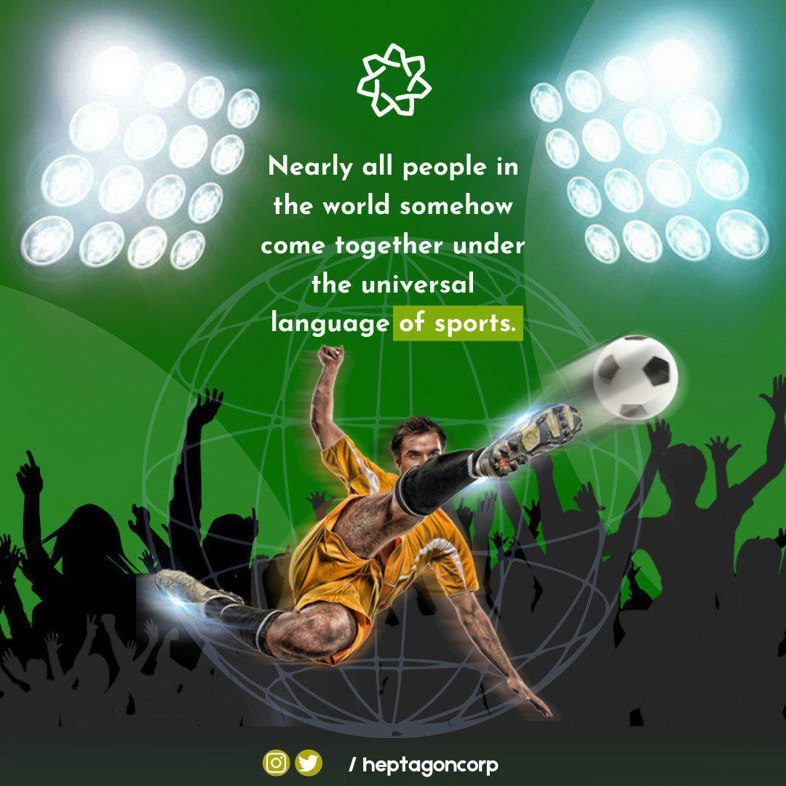

# Heptagon Adevertising

* The  advertising  and sponsorship  agreements as well as the broadcasting rights, occasioned by these  events, by  professional athletes will generate royalties that will be managed and promoted  within our Heptagon Ecosystem. Additionally, the use  of  gaming  applications  like  E-Sports and NFT (Non-Fungible Token) assets have  been  gaining  popularity  and will render our platform more appealing to our users.&#x20;
*

    <figure><figcaption></figcaption></figure>
* Industry assessment; According to a recent study, originated by Kearney, a leader in Global  management and consulting, the estimated value of the Sports Industry is    approximate  USD  480  -  620   billion   U.S.Dollars.   The   Global   Media  and Entertainment  ndustry  value  alone  will reach the cap of USD2.6 trillion by 2025. These   astronomic  figures  that  are  on  the rise  include  infrastructure, sporting goods,   licensed  products,  the  broadcasting  of  all  live  sporting events and so much more.&#x20;
* Sporting  goods  market;  At  an estimated amount of USD126.23 billion presently, the value of the global sporting goods market will reach the sum of approximately USD148.2  billion  by the year 2023 and will just keep rising. E-Sport; In a detailed breakdown  of  the  gaming  market,  Newzoo  has revealed important information about&#x20;
* E-Sports in terms of revenue and gamer forecasts. E-Sports, relatively new to the gaming ecosystem has succeeded in shaping  the  gaming industry with revenues exceeding USD 1  billion  and  has  begun  to  take  its  own  space  in  the  gaming ecosystem.&#x20;
* Heptagon’s direction: The information and research gathered  and shared globally is immeasurable.  Our  objective  in  Heptagon is to carry all  these breakthroughs and formulas into the METAVERSE  UNIVERSE  and  create  a  New World. A world that is there to band together all users and unite them to build something that will exceed all expectations.
