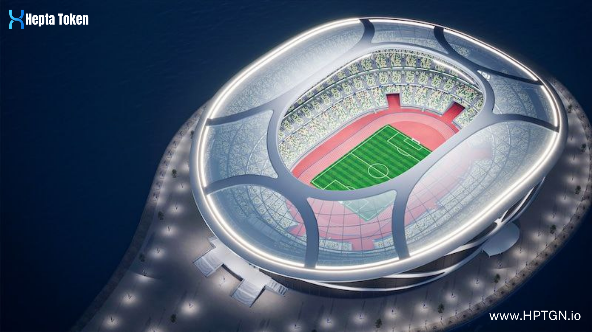

# Heptagon Metaverse

* Heptagon Metaverse also claims to be the basic universe of Virtual Sports Store, that Users can buy and sell a limited number of NFTs produced and shop at the official club store or sports stores.
* Heptagon Metaverse will also serve as a marketing area for people and companies who want to market their products or services.
*

    <figure><figcaption>
Heptagon Stadium
</figcaption></figure>
* Heptagon Metaverse also claims to be the core universe of Virtual Sports Stores.
* Users will be able both to buy and sell limited-edition NFTs and shop from official club stores or sportsshops.
* Heptagon Metaverse will also serve as a marketing area for individuals and companies that want to market their products or services.
* The basic unit to be used in this entire ecosystem is the Hepta Token.
* Hepta will serve as a Token that is not only spent but also earned by the Stake Pool and gained at the end of the competitions.
* With Heptagon Metaverse, the universal value of Sports will be reinterpreted and made sense in a Global ecosystem.
* All Sports All Device All Platform....

