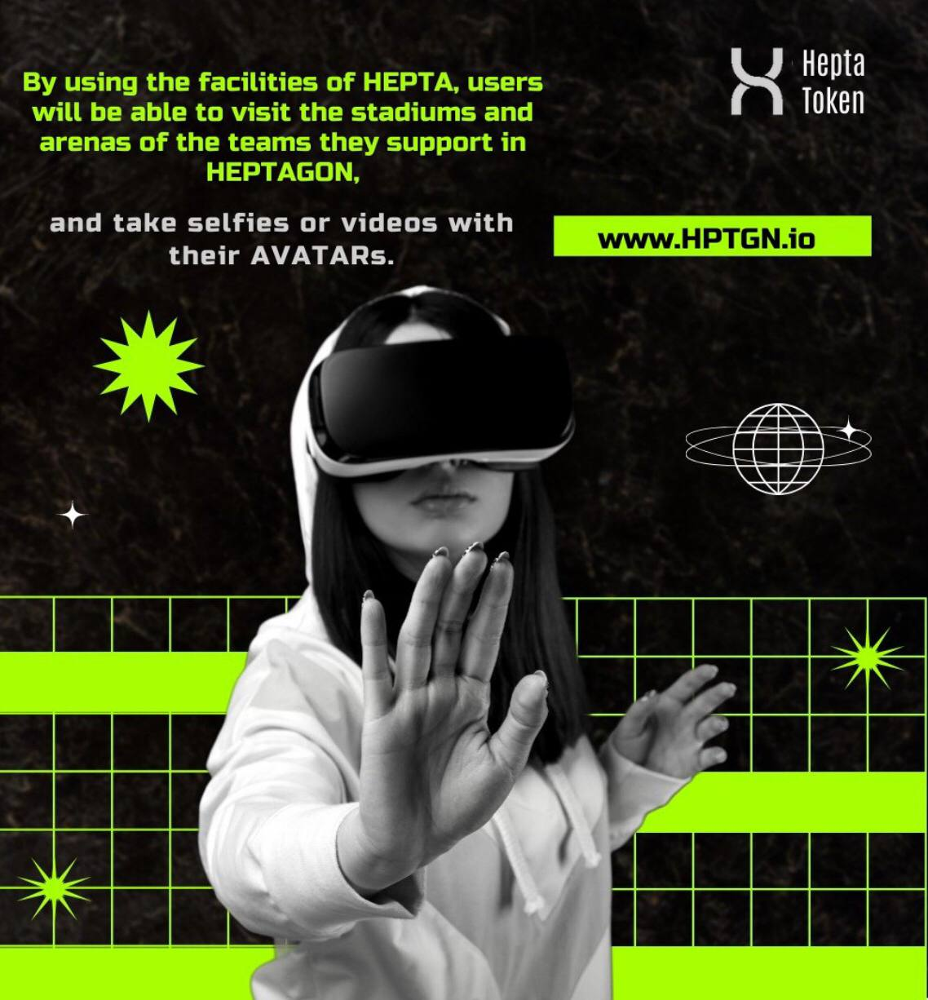

# Heptagon Metaverse

<figure><figcaption>
NFTs and Avatar
</figcaption></figure>

&#x20;    The basic principle of the Heptagon Metaverse is to transfer the world of Sports to the Metaverse Area. For this purpose, we are reconstructing the Stadiums and Arenas in  the  Real  World  in  the  Metaverse  Universe  by  scaling  them  with  their  current locations in the Metaverse Space. In this area, where Clubs,  companies  operating  in the field of Sports, and Sports Wear Brands will  be  located, apart from Stadiums and Arenas, users will  be able to  both  watch  sports events in 3D in Stadiums built in the Virtual  Universe  and  shop  in   stores   built   for   companies   operating   on  sports, especially  Sports  Wear  Stores  and  Sports  Gear  Stores. Heptagon Ecosystem: Our Ecosystem  is  abundant  and  widespread.  It   will   set  in   motion   and  trigger   the acquisitions  and  purchases  of  numerous  commodities and products, such as Team Sportswear ex. (Jerseys) and Sports Gear ex. (shoes).
