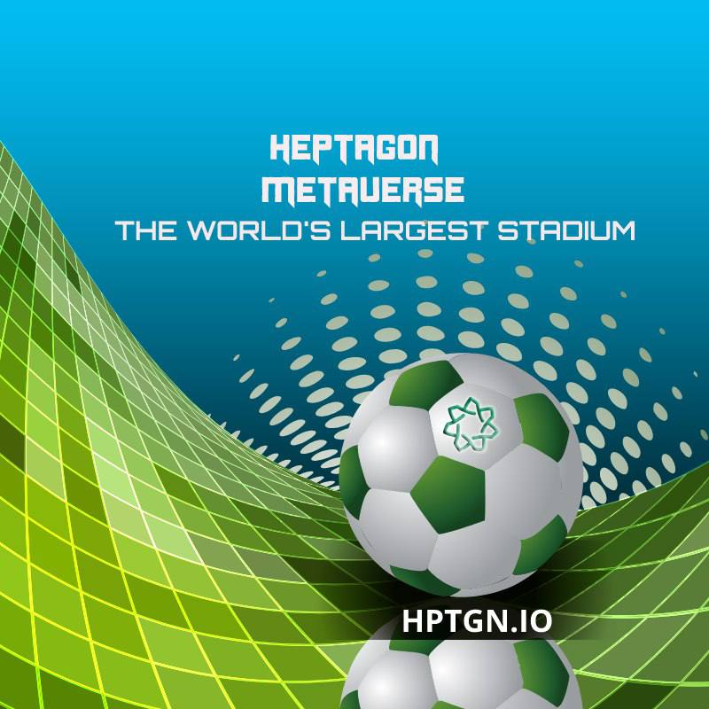

# Heptagon Metaverse Revenues

1-Live broadcast  revenues: All live broadcasts will be watched in exchange for Hepta Tokens.&#x20;

2-Commission  income  from  shopping  transactions:  Hepta  Token  will  be  taken as commission from all transactions to be made from Stores in Heptagon Metaverse.&#x20;

<figure><figcaption></figcaption></figure>

3-Hepta  Token  commission  income  from  NFT  Market,  Avatar   Market,  NFT   land purchases and sales.&#x20;

4-Heptagon Metaverse advertising revenues: Sports clubs, Sports Stores' advertising revenues will be received as Hepta Tokens.&#x20;

5-Income  from rentals  and  purchases  of  Metaverse Stores: All Store, Space, rental, and purchase-sale transactions will be made in exchange for Hepta Tokens.&#x20;

6-Sponsorship  revenues:  All  sponsorship  agreements  will  be  made through Hepta Token and revenues will be transferred to Heptagon Metaverse.
