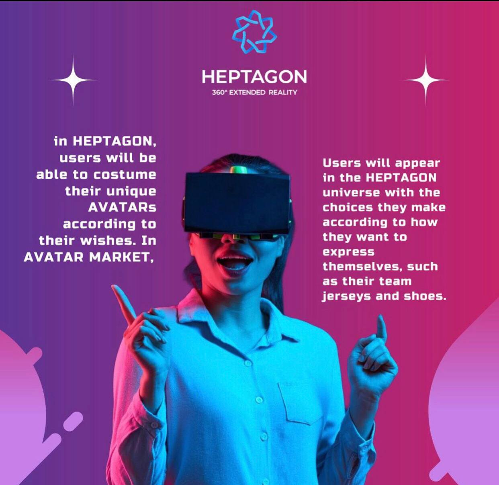

# Income & Expenses

<figure><figcaption></figcaption></figure>

* Sponsored Deal revenues&#x20;
* NFT and avatar market transaction revenues&#x20;
* Live streaming fee revenues&#x20;
* Club official store rental and vehicle revenues&#x20;
* Sporting goods and club official product transaction sales revenues&#x20;
* Metaverse land sales and trading commission income Expenses

&

* Server Expenses&#x20;
* Marketing Expenses&#x20;
* Metaverse Domain Development Expenses&#x20;
* Company Expenses & Taxes&#x20;
* Personnel expenses
