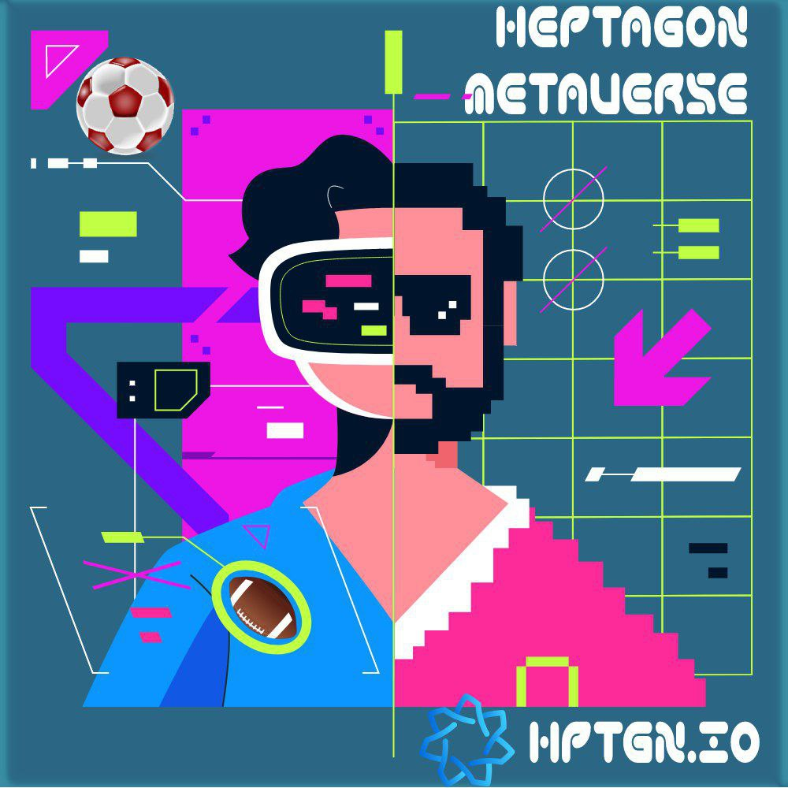

# Metaverse -4

&#x20;        Function process. Mapping; All of the infrastructure (stadiums, arenas ….) will be produced on the 3D platforms, based on Earth Maps.

&#x20;         All of  these buildings will be added to HEPTAGON in line with the demands and requests of the  members of our community. Fans and members will contribute to the construction of existing infrastructure from the Real World to the Virtual Universe.

<figure><figcaption></figcaption></figure>

&#x20;         Avatar  Identity; In  our Heptagon Metaverse all users will be acknowledged and treated as entities via the Avatar  of their choice. The identity card transported in this universe   will  be  the  self - character  of  that  user in Heptagon. This identity will be found  in  the  user’s   crypto   asset   wallet  as  NFT   on   Blockchain.   Avatar   attire; Additionally,  members  will  be  capable  to  alter  and  transform their unique Avatars according to their aspirations. Choosing through a variety  of attire as the jerseys and shoes  of  their  favorite teams and consequently will have the opportunity to express themselves using such assets.

&#x20;       Trading NFTs; All members of our community, will be able to trade NFTs. Crafting their  own  NFTs  on Blockchain and selling them in the NFT Market. In addition, users will also  be  able  to  access  VINTAGE SERIES NFTs from the VINTAGE MARKET. NFT series of champion teams and NFT  series  of champion athletes will be generated on Blockchain  as  a  collection  and  can  be  sold  at  our HEPTAGON VINTAGE MARKET. Heptagon Swap; Thanks  to  the  HEPTAGON  give - and- take, members will have the chance  to  swiftly  and  securely  swap their FAN TOKENS for the HEPTA, HEPTAGON Metaverse token.
