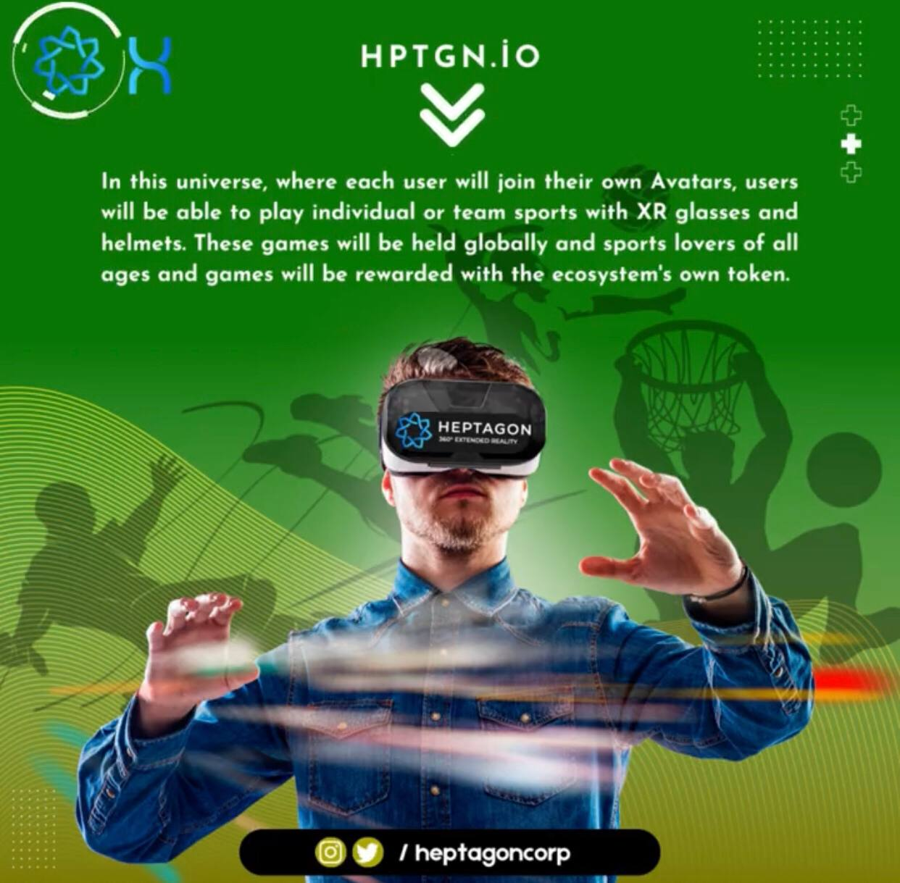

# Metaverse

&#x20;     Metaverse  is to  bring the existing physical universe  to the virtual environment in some  respects,  allowing  people  to  interact  in  this  virtual  environment  in  a  real-worldlike space. People can play games on the Metaverse, keep track of their work at home, or participate in various activities with their friends.  People  can  now  shop  in augmented reality in the Metaverse, visit tourist  attractions, participate in 3D games, meet friends, hold  business  meetings  or  spend time in this virtual environment. In a sense,   the  Metaverse  is  the  projection  of  the  natural  and   limited   world  as  an unlimited space in a Virtual environment.

<figure><figcaption></figcaption></figure>
