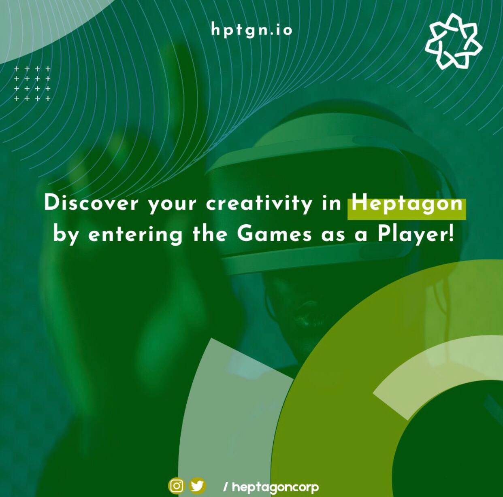

# OUR MISSION

&#x20;    The primary mission of Heptagon Metaverse is to create a world where all sports fans in the world can watch live broadcasts in the

&#x20;  Metaverse environment, shop from Sports Stores, mint and trade NFTs, participate in individual or team sports with their Avatars, and do sports in the Metaverse area under one roof.

<figure><figcaption>
Fun World
</figcaption></figure>

&#x20;

&#x20;     However, as Heptagon, we believe that the most critical feature of Metaverse should be a universe that benefits users with an economy

that revolves around a decentralized structure. For this reason, we create new opportunities for investors by reinterpreting the economic

structure of the Sports World in the metaverse area. In a word, we are building a new universe for the Sports Economy by bringing

the World of Sports to the Metaverse Field with Blockchain technologies' products.

&#x20;****&#x20;

**The World of Sports**

&#x20;          Nearly all people in the world somehow come together under the universal language of sports. People are not only beings that do sports but are also the fundamental factor that broader $600 billion. creates an economy more extensive than the national income of more than half of the world's countries, with a total size of more than 600 billion dollars, both as spectators and through purchasing products. We foresee that with the interpretation of this economy, which exceeds roughly 600 billion dollars, in the Metaverse area, a much larger industry will be formed, and people can benefit from this industry in a much sense.

Summary&#x20;

The total size of the sports economy is over $600 billion.
