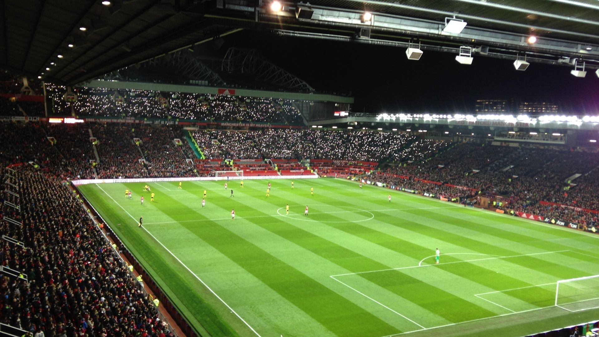

# PROBLEM AND SOLUTIONS

* With the increasing population in the  world, we  live in  today, while the endless demands of people are increasing, the opportunities are decreasing at that rate or even more.&#x20;
* One thing is certain even the world's largest stadiums have a limited capacity in the last instance.&#x20;
* Moreover, the problem with people's access is not only the limited seat capacity of the Stadiums or Arenas.&#x20;

<figure><figcaption>
Real Stadium 
</figcaption></figure>

* There are far greater barriers to  people's  access to this  restricted Area. First of all, not every person can travel to the country where the championship is held to watch the closing game of the world cup, or it is not an easy task for a person to go to  America from Japan to watch the  Match of the team who is a fan of in the NBA league.&#x20;
* The first obstacle in front of people is their economic limits, and the second and much more  important  obstacle is  time. Even if the possibilities have expanded economically, human time is not a reality that can scale up to that extent.&#x20;
* Time is a constantly flowing and disappearing phenomenon as the most valuable asset of us. However, people can watch sports events in the unlimited number of seats that  will be created in the Stadiums to be created in  Virtual  Environments, and with the  solution  proposal of  Heptagon  Metaverse, they  can  do  this with minimum cost  and  minimum  time  loss. While going to work on the train or ferry, people can connect to Heptagon  Metaverse  and  watch  the matches in 3D as if they were in the Stadium.&#x20;
* Or people can play  Tennis  with  virtual  shoes  and gloves to wear while sitting at home or join a Virtual American football tournament with their friends in Heptagon Metaverse.&#x20;
* In a  sense,  with  Heptagon  Metaverse, we  facilitate the very hard-to-reach and make it available to the user with minimum cost and time.&#x20;
* We know that not all of the  people around  us vacation on the island of Hawaii, and perhaps never will. But thanks to Augmented reality, it is possible to take a tour of Hawaii, it is a technology that makes the more inaccessible, more easily accessible to us.&#x20;
* Again, sports fans do not have  a chance  to watch  the match of the team they support in the stadium at the same time. Because while the stadiums have very limited physical conditions, the number of fans of the teams reaches millions. However, with Heptagon Metaverse, fans will have the chance to watch their team's matches at their homes, workplaces, or wherever they are, as if they were in the stadium, without a number limit.&#x20;
* Thus, on the one hand, the sports world will be transferred to the metaverse, and on the other hand, the number of game tickets sold in limited numbers will suddenly increase to an unlimited number, making a brand new contribution to the sports economy.
* We were playing games on our computers before, now we are in the game itself in the Metaverse universe.&#x20;
* We can become a part of the game by taking part in the game.&#x20;
* Metaverse drags gamers towards becoming a part of the game they are playing.&#x20;
* In an American football game in the Heptagon Metaverse, you have to be much more careful while passing between your opponents with the ball in your hand because, in case of any collision with wearable sensor virtual reality objects, you can get hurt a little!&#x20;
* The inaccessible is now much more accessible, and the beyond reach is much more reachable. We bring the world of sports to Metaverse.&#x20;
* This universe offers us much greater possibilities than the universe we have experienced so far. With Wearable Virtual Reality helmets or Wearable Virtual Reality glasses, wearable Virtual Reality gloves, and Wearable Virtual Reality shoes, open the doors of a whole new world to us, although it has a rough appearance for now. We call this new universe the Metaverse.&#x20;
* In the metaverse universe, people can shop with augmented reality, visit tourist attractions, participate in 3D games, meet with friends, hold business meetings or spend time alone in a dream environment.
