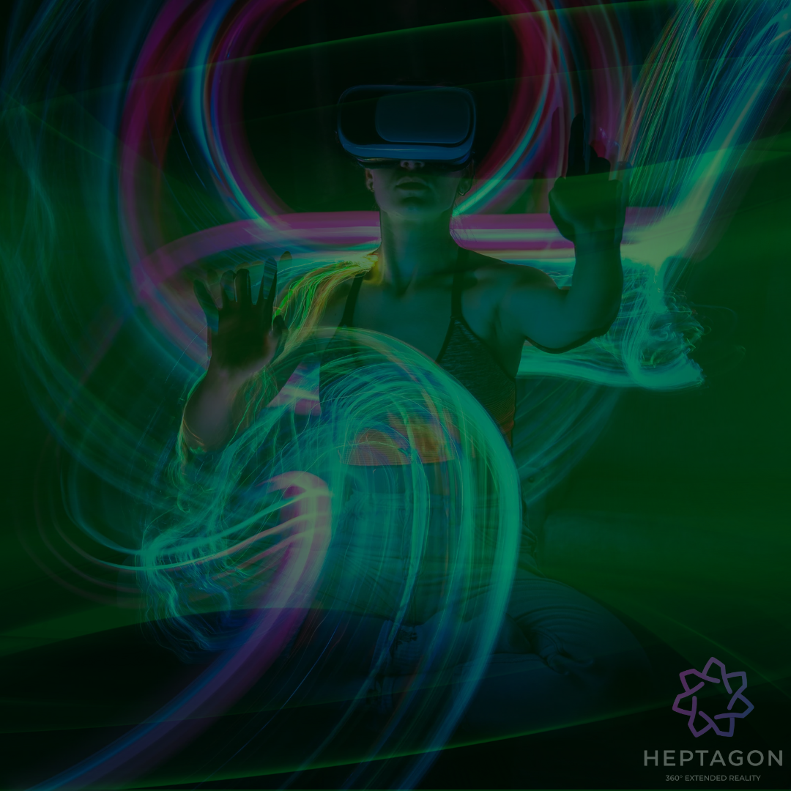

# Sports Metaverse

Limits and Opportunities :

While economic limits and time are the most important reality that restricts people, with Metaverse, the doors of the opportunity for people to reach the inaccessible are opened.&#x20;

<figure><figcaption>
Extended Reality
</figcaption></figure>

A new "ERA" in Access to Sports :

We are unlimiting the limited number of Stadium and Arena seats. We are planning to bring the tickets for very high-cost sports events to much more people, and a more affordable period will come in these ticket costs.&#x20;

We allow you to spend more time with yourself :

For people who do not have time to go to stadiums, arenas and courts, we make these areas an area where they can participate in 3D with their phones, tablets and computers.
